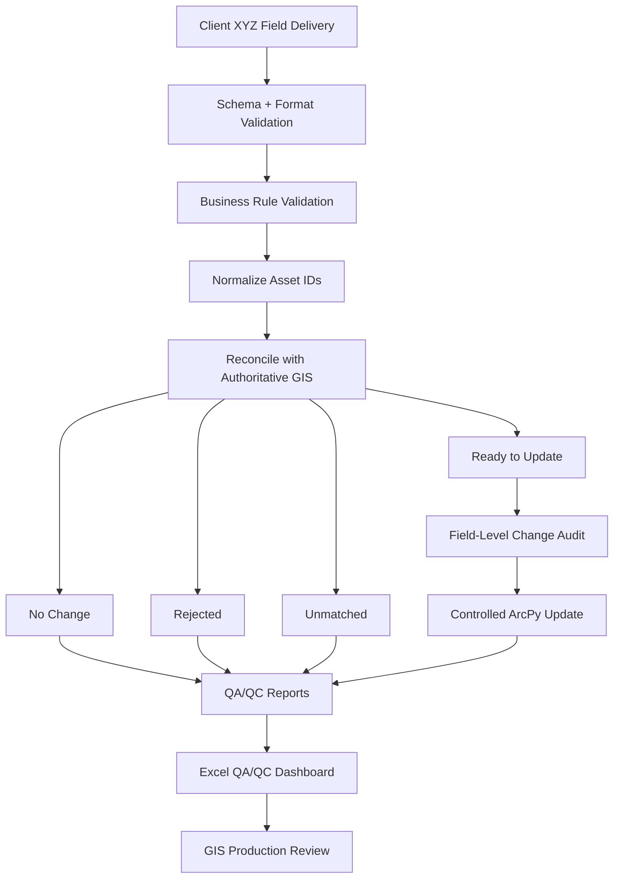

# Day 01 — Client Field Data Validation & GIS Reconciliation

## Status

🟡 **In progress — expanded corporate scenario ready for clean rerun**

## Corporate Problem

The GIS department receives recurring field-data deliveries from **Client XYZ** containing asset inspection and maintenance updates.

Before the GIS production team can use the delivery for editing, mapping, spatial analysis, reporting, or downstream business processes, the incoming data must be validated against the organization's **authoritative GIS asset inventory** and internal data standards.

Incoming client files may contain missing IDs, duplicate records, invalid domain values, inconsistent ID formatting, unmatched assets, stale inspection dates, incomplete updates, malformed dates, or values outside accepted ranges.

Because this delivery is recurring, manual QA/QC would be repetitive, slow, difficult to audit, and vulnerable to inconsistent decisions.

## Developer Assignment

Build a reusable **pre-ingestion GIS data quality gate** that validates, cleans, reconciles, audits, and prepares the incoming Client XYZ delivery before it reaches the GIS production team.

The workflow must be simple to run, repeatable, configurable, and understandable to GIS staff while still enforcing client requirements and organizational standards.

## Architecture



## Exercise Data

All records are **synthetic** and generated deterministically from code.

| Dataset | Scale | Purpose |
|---|---:|---|
| Authoritative GIS | 1,000 point assets | Organization's current accepted asset inventory |
| Client XYZ delivery | 300 records | Recurring field inspection / maintenance updates |

### Authoritative GIS fields

`asset_id`, `asset_type`, `status`, `priority`, `region`, `district`, `inspector`, `install_date`, `last_inspection`, `condition_score`, `pressure_psi`, geometry.

### Incoming Client XYZ fields

`client_record_id`, `asset_id`, `status_new`, `priority_new`, `inspector_new`, `inspection_date`, `condition_score_new`, `pressure_psi_new`, `comments`.

The synthetic delivery deliberately includes valid changes, no-change records, partial updates, stale inspections, invalid domains, invalid numeric ranges, malformed dates, missing IDs, duplicate IDs, unmatched IDs, and formatting inconsistencies.

## Organizational Rules

Rules are stored in `config/client_xyz_rules.json` rather than scattered throughout the notebook.

Key rules include:

- required incoming fields must exist,
- `asset_id` is normalized by trimming whitespace and converting to uppercase,
- asset IDs must follow the organization pattern,
- duplicate and missing IDs are rejected,
- status and priority must use approved domain values,
- numeric values must stay within accepted ranges,
- malformed dates are rejected,
- unmatched IDs are preserved for review,
- stale inspection records cannot overwrite newer authoritative information,
- blank fields in partial updates preserve existing GIS values,
- only actual changes are approved for update.

## Processing Outcomes

Every incoming record is assigned one production outcome:

| Outcome | Meaning |
|---|---|
| 🟢 `READY_TO_UPDATE` | Valid, matched, and contains one or more actual changes |
| 🔵 `NO_CHANGE` | Valid and matched, but authoritative GIS already contains the same values |
| 🔴 `REJECTED` | Fails schema/data/business-rule validation |
| 🟡 `UNMATCHED` | Validly formatted ID is not present in authoritative GIS |

## Outputs

The workflow produces:

- controlled local GIS updates,
- `ready_to_update.csv`,
- `rejected.csv`,
- `unmatched.csv`,
- `no_change.csv`,
- `change_audit.csv`,
- visual Excel QA/QC workbook: `XYZ_GIS_Data_Validation_Report.xlsx`.

Generated working data and reports remain local under `data/sample/` and `output/` and are excluded from Git.

## Excel QA/QC Dashboard

The automated workbook provides restrained, corporate color coding and includes:

- records received,
- ready-to-update count,
- rejected count,
- unmatched count,
- no-change count,
- data quality score,
- validation-status distribution,
- rejection-reason chart,
- field-level proposed change count,
- processing time,
- supporting record-level sheets.

The dashboard is intended to translate technical validation into a quick operational review for GIS leads, analysts, and project managers.

## Repository Structure

```text
day-01-excel-gis-update/
├── README.md
├── Day01_Excel_to_GIS_Update_Automation.ipynb
├── config/
│   └── client_xyz_rules.json
├── data/
│   ├── create_sample_data.py
│   └── sample/                    # generated locally
├── src/
│   ├── update_features.py
│   └── generate_dashboard.py
├── output/                        # generated locally
└── screenshots/
```

## Developer Focus

Day 01 introduces more than ArcPy syntax:

- requirements and acceptance criteria,
- authoritative-source reconciliation,
- configurable business rules,
- data normalization,
- defensive validation,
- exception handling,
- change detection,
- partial-update behavior,
- field-level auditing,
- ArcPy cursors,
- reproducible synthetic test data,
- Excel dashboard reporting,
- Git branches, commits, push, pull requests, and review.

## Acceptance Criteria

The complete criteria are maintained in GitHub Issue #1. Day 01 is complete only after the expanded workflow is rerun cleanly, reviewed through PR #2, and merged to `main`.

## Core Principle

> **Validate first → reconcile → audit → edit.**

The production GIS environment should receive trusted data, not raw client data.
